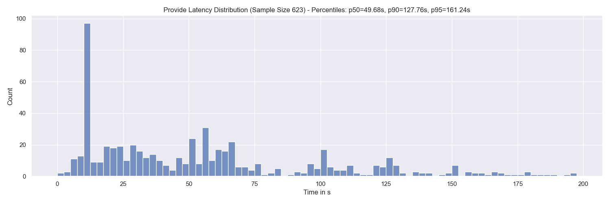
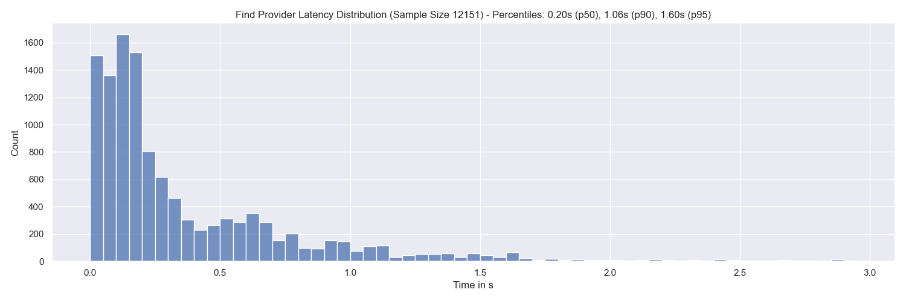
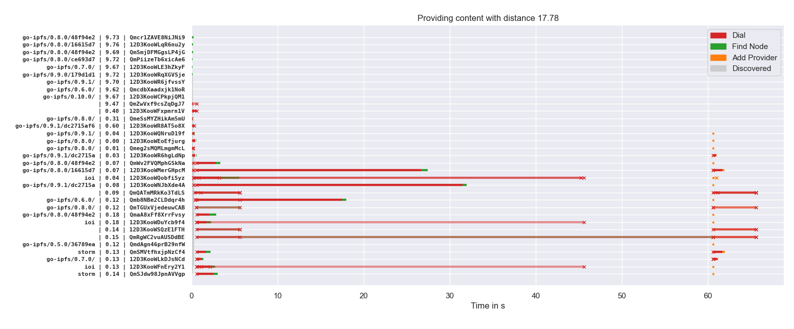
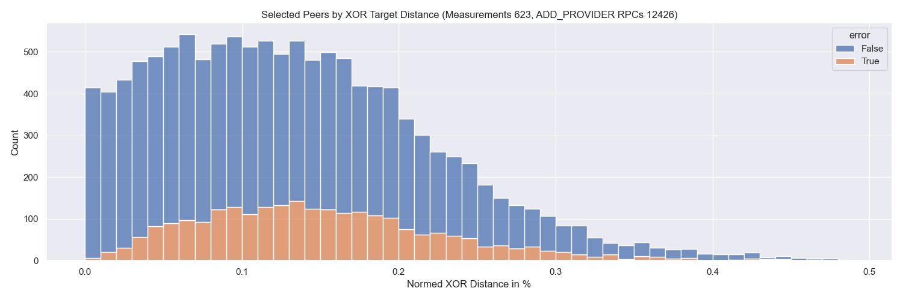
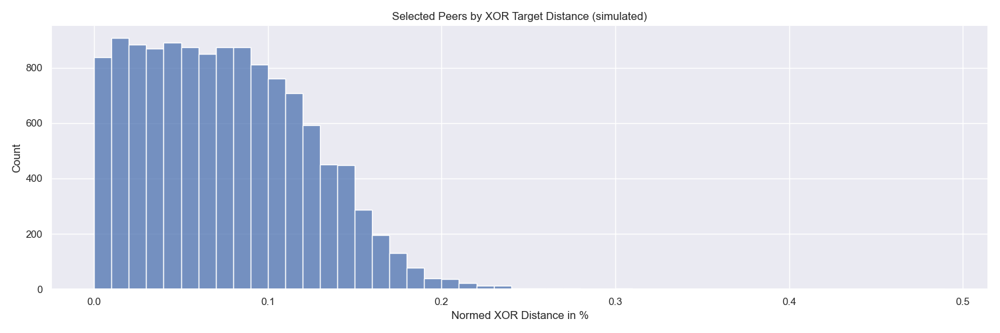
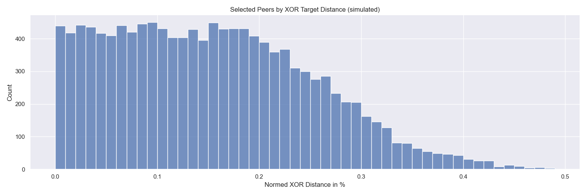

# Optimistic Provide

[](https://github.com/dennis-tra/tenma-probe/blob/main/LICENSE)

This repo contains a libp2p DHT performance measurement tool. As of now, it primarily measures the performance of providing content in the network.

Below you can find a proposal for an alternative approach to providing content.

## 🚧 Work In Progress - Proposal - Optimistic Provide

## Abstract

The lifecycle of content in the IPFS network can be divided in three stages: publication, discovery and retrieval.
In the past much work has focussed on improving content discovery while efficiently storing provider records at appropriate peers is similarly important as it needs to be repeated periodically.
This document proposes an optimistic approach to storing provider records in the libp2p Kademlia DHT to significantly speed up the process 
based on a priori information about the network size and accepting minimal too many provider records.

## Motivation

When IPFS attempts to store a provider record in the DHT it tries to find the _beta_ (20) closest peers to the corresponding `CID` (XOR distance).
To find these peers IPFS sends `FIND_NODES` RPCs to the closest peers it has in its routing table and then repeats the process for the returned set of peers.
There are two termination conditions for this process:

1. Termination: The current _beta_ closest peers were queried for even closer peers but didn't yield closer ones.
2. Starvation: All peers in the network were queried (if I interpret this condition correctly: `q.queryPeers.NumHeard() == 0 && q.queryPeers.NumWaiting() == 0`)

This can lead to huge delays if some of the 20 closest peers don't respond timely or are straight out not reachable.
The following graph shows the provide latency distribution.



In other words, it shows the distribution of how long it takes for the `dht.Provide(ctx, content.cid, true)` call to return.
At the top of the graph you can find the percentiles and total sample size. There is a huge spike at around 10s which is probably related to an exceeded context deadline - not sure though.

If we on the other hand look at how long it took to find the peers that we eventually stored the provider records at, we see that it takes less than 1.6s for the vast majority of cases.



The sample size corresponds to roughly `623 * 20` as in every `Provide`-run we attempt to save the provider record at _beta_ (20) peers. I'm not sure why the Sample Size is not exactly `623 * 20 = 12460`.

This repository also contains code to visualize the provide process. Here is an example:



This visualization is similar to [this Multi-Level DHT Report](https://drive.google.com/file/d/1OfFyi4VO3itNc3O-YoUqW1Q6D0Fp1Crz/view) page 17 (document) or page 21 (PDF).
The left-hand side shows the agent version, the [normed XOR distance](#normed-xor-distance) in percent of the particular peer to the CID being provided, and the peer ID truncated to 16 characters.
The title indicates the normed XOR distance of the providing peer to the CID being provided.
Muted colors and `x` markers indicate failed operations.
The peers are ordered by the time they were discovered after the provide operation started.

## Proposal - Optimistic Provide

The discrepancy between the time the provide operation took and the time it could have taken led to the idea of just storing provider records optimistically at peers.
This would trade storing these records on potentially more than _beta_ peers but could yield a vast speed up.
It also requires a priori knowledge about the current network size which can be estimated based on network observation of crawls like it was implemented in the [new experimental DHT mode](https://github.com/libp2p/go-libp2p-kad-dht/releases/tag/v0.12.0).

### Procedure

When finding a new peer with Peer ID `P` in the process of providing content we calculate the distance to the CID `C` and derive the expected amount of peers `μ` that are closer to the CID than the peer with peer ID `P`.

If we norm `P` and `C` to the range from `0` to `1` this can be calculated as:

```
μ = || P - C || * N
```

`N` is the current network size. The logic would be that if the expected value `μ` is less than _beta_ peers we store the provider record at this peer `P`.

This threshold could also consider standard deviation etc. and could generally be tuned to minimize falsely selected peers (peers that are not in the set of the _beta_ closest peers).

### Example

The following graph shows the distribution of [normed XOR distances](#normed-xor-distance) of the peers that were selected to store the provider record to the CID that was provided.



 The center of mass of this distribution is roughly at `0.1 %`.
So If we find a peer that has a distance of `|| P - C || = 0.1 %` while the network has a size of `N = 7000` peers we would expect to find `7` peers that are closer than the one we just found. 

`N = 7000` is a realistic assumption based on [our crawls](https://github.com/dennis-tra/nebula-crawler).

### Simulation

_**The following doesn't model the above distribution very well, yet**_

Assumptions:

- Peer IDs are uniformly distributed across the entire key space
- The number of DHT server peers is `7000` (got this number from [our crawl results](https://github.com/dennis-tra/nebula-crawler)).

```python
import numpy as np

NETWORK_SIZE = 7000
MEASUREMENTS = 623
BETA = 20
distances_all = []
peer_ids = np.random.uniform(0, 1, NETWORK_SIZE)
for i in range(MEASUREMENTS):
  cid = np.random.random()
  distances = np.sort(np.abs(peer_ids - cid))

  for dist in distances[:BETA]:
    distances_all += [dist * 100]
``` 



The above probably has a faulty reasoning as the distribution matches the measurements a little closer with half the network size (3500):




## Methodology

### Measurement Setup

The measurements were conducted on the following machine:

- `vCPU` - `2`
- `RAM` - `4GB`
- `Disk` - `40GB`
- `Datacenter` - `nbg1-dc3`
- `Country` - `Germany`
- `City` - `Nuremberg`

The following results show measurement data that was collected from 2021-11-05 to 2021-11-07.

- Number of measurements `623`


### Normed XOR Distance

In the graphs you will find XOR distance values in the range from 0 to 1 or their corresponding percentage representation. These values are derived by dividing the 256-bit XOR distance by `2^256`. Since the maximum possible XOR distance between two values in the 256-bit key-space is `2^256`, the division by this maximum norms the resulting distance value into the range from 0 to 1. This is solely done to work with more handy numbers. As the distance can become quite small the graphs may also show the distance as a percentage from the 0 to 1 range.

---

## Maintainers

[@dennis-tra](https://github.com/dennis-tra).

## Contributing

Feel free to dive in! [Open an issue](https://github.com/dennis-tra/tenma-probe/issues/new) or submit PRs.

## License

[Apache License Version 2.0](LICENSE) © Dennis Trautwein
