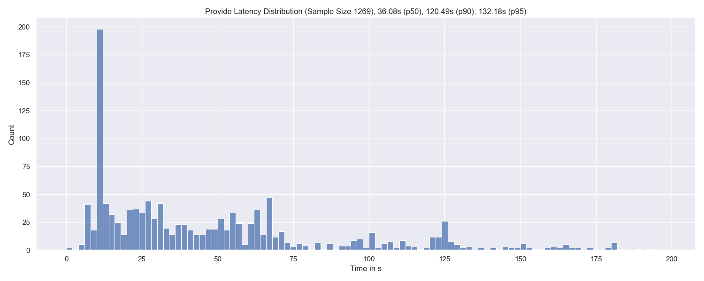
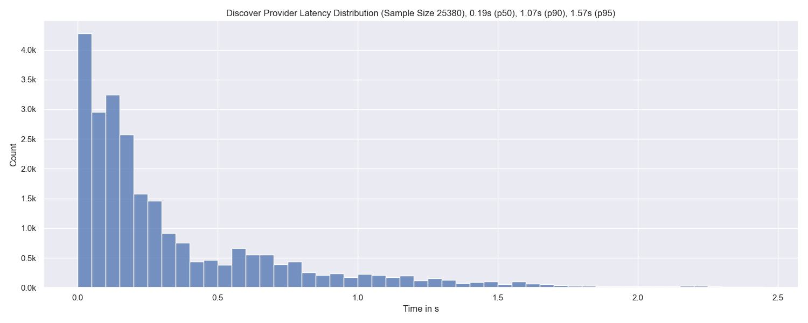
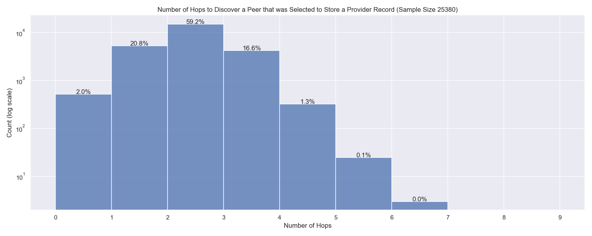
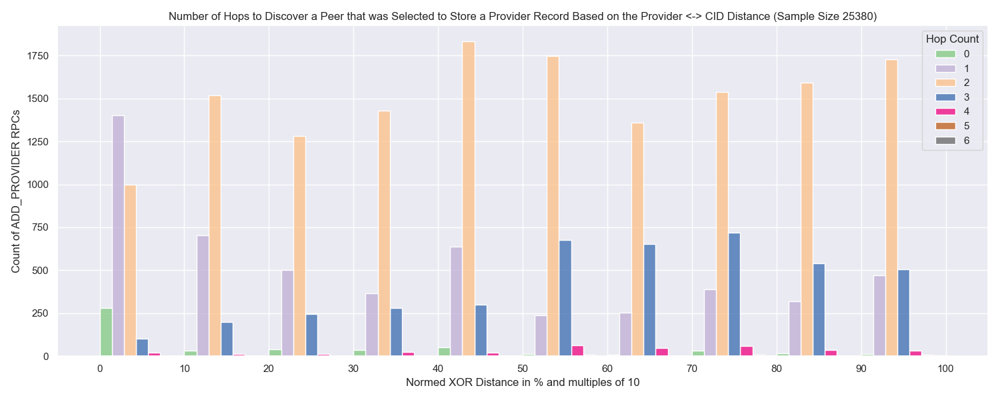
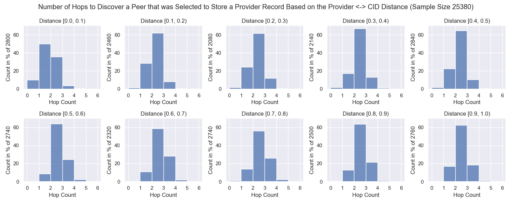
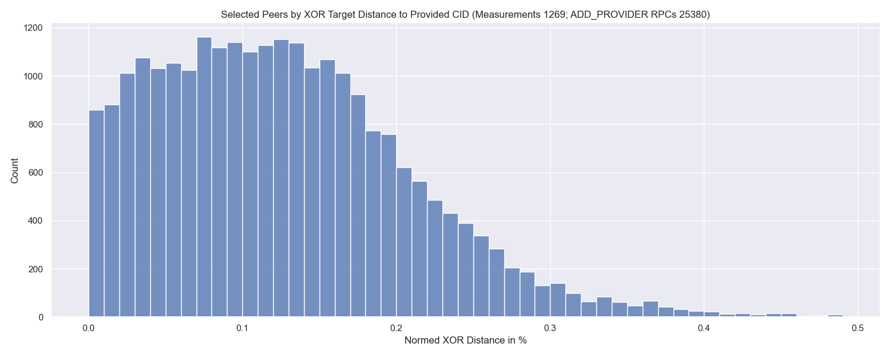
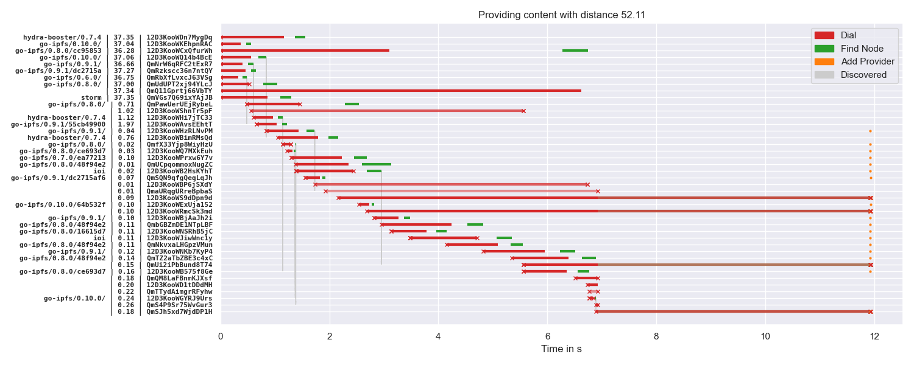

# Optimistic Provide - Tool & Proposal

[](https://github.com/dennis-tra/optimistic-provide/blob/main/LICENSE)

This repo contains:

1. A libp2p DHT performance measurement tool. As of now, it primarily measures the performance of providing content in the network.
2. A proposal for an alternative approach to content providing.

> **TL;DR:** For each peer, we come across during content publication, calculate the probability of an even closer one. If the likelihood is low, just store the provider record at that peer optimistically.

## Table of Contents

- [Table of Contents](#table-of-contents)
- [Proposal - Optimistic Provide](#proposal---optimistic-provide)
  - [Abstract](#abstract)
  - [Motivation](#motivation)
  - [Related Work](#related-work)
  - [Optimistic Provide](#optimistic-provide)
    - [Procedure](#procedure)
    - [Example](#example)
    - [Network Size](#network-size)
  - [Methodology](#methodology)
    - [Setup](#setup)
    - [Measurement Process](#measurement-process)
  - [Normed XOR Distance](#normed-xor-distance)
  - [Process visualization](#process-visualization)
- [Maintainers](#maintainers)
- [Development](#development)
- [Contributing](#contributing)
- [License](#license)

## Proposal - Optimistic Provide

### Abstract

The lifecycle of content in the IPFS network can be divided into three stages: publication, discovery, and retrieval.
In the past, much work has focussed on improving content discovery while efficiently storing provider records at appropriate peers is similarly important because it needs to be repeated periodically.
This document proposes an optimistic approach to storing provider records in the libp2p Kademlia DHT to speed up this process significantly. It is based on a priori information about the network size. It comes with the trade-off of potentially storing more provider records than desired.

### Motivation

When IPFS attempts to store a provider record in the DHT it tries to find the 20 closest peers to the corresponding `CID` using the XOR distance.
To find these peers, IPFS sends `FIND_NODES` RPCs to the closest peers in its routing table and then repeats the process for the set of returned peers.
There are two termination conditions for this process:

1. **Termination**: The 20 closest peers to the CID were queried for even closer peers but didn't yield closer ones.
2. **Starvation**: All peers in the network were queried (if I interpret [this condition](https://github.com/libp2p/go-libp2p-kad-dht/blob/cd05807c54f3168f01a5a363b37aee5e38fee63d/query.go#L368) correctly)

This can lead to huge delays if some of the 20 closest peers don't respond timely or are straight out not reachable.
The following graph shows the latency distribution of the whole provide-process for 1,269 distinct provide operations.



In other words, it shows the distribution of how long it takes for the [`kaddht.Provide(ctx, CID, true)`](https://github.com/libp2p/go-libp2p-kad-dht/blob/0b7ac010657443bc0675b3bd61133fe04d61d25b/fullrt/dht.go#L752) call to return.
At the top of the graph you can find the percentiles and total sample size. There is a huge spike at around 10s which is probably related to an exceeded context deadline - not sure though.

If we on the other hand look at how long it took to find the peers that we eventually **attempted** stored the provider records at, we see that it takes less than 1.6s in the vast majority of cases.



Again, sample size and percentiles are given in the figure title. The sample size corresponds to `1269 * 20` as in every `Provide`-run we attempt to save the provider record at 20 peers.

The same point can be made if we take a look at how many hops it took to find a peer that we eventually **attempted** to store the provider records at:



Note the log scale of the `y`-axis.

Over 98 % of the times an appropriate peer to store the provider record at was found in 3 hops or less.

The following graph shows the above distribution depending on the [normed XOR distance](#normed-xor-distance) of the providing peer to the CID being provided.



<details>
<summary>View this graph as multiple plots</summary>

</details>

If the distance is small (0 - 10 %) most of the times it only takes one hop to discover an appropriate peer. As the distance increases the distribution shifts to more hops - though it's not as clear as I expected it to be.

### Related Work

The [IPFS Content Providing Proposal](https://github.com/protocol/web3-dev-team/blob/main/proposals/ipfs-content-providing.md) focusses on (1) improving the experience of users that want to advertise large amounts of CIDs and (2) improve the performance of advertising a single CID.

> Currently, go-ipfs users are able to utilize the public IPFS DHT to find who has advertised they have some CID in under 1.5s in 95+% of cases. However, the process of putting those advertisements into the DHT is slow (e.g. 1 minute) [...].

These numbers are in line with the above measurements. One of the goals of that proposal is to

> [m]ake IPFS public DHT puts take <3 seconds [...].

To achieve this four techniques are proposed:

> - Decreasing DHT message timeouts to more reasonable levels
> - Not requiring the "followup" phase for puts
> - Not requiring responses from all 20 peers before returning to the user
> - Not requiring responses from the 3 closest peers before aborting the query (e.g. perhaps 5 of the closest 10)

This propsoal suggests a fifth option for that list but won't address the bottleneck of advertising large amounts of CIDs. Though, you could argue that if content providing becomes faster that bottleneck is alleviated as well.

### Optimistic Provide

The discrepancy between the time the provide operations take and the time it could have taken led to the idea of just storing provider records optimistically at peers.
This would trade storing these records on potentially more than 20 peers for decreasing the time content becomes available in the network.
Further, it requires a priori information about the current network size.

<!-- which can be estimated based on network observation of crawls like it was implemented in the [new experimental DHT mode](https://github.com/libp2p/go-libp2p-kad-dht/releases/tag/v0.12.0). -->

#### Procedure

Let's imagine we want to provide content with the CID `C` and start querying our closest peers.
When finding a new peer with Peer ID `P` we calculate the distance to the CID `C` and derive the expected amount of peers `μ` that are even closer to the CID (than the peer with peer ID `P`).

If we norm `P` and `C` to the range from `0` to `1` this can be calculated as:

```text
μ = || P - C || * N
```

Where `N` is the current network size and `|| . ||` corresponds to the XOR distance metric.

The logic would be that if the expected value `μ` is less than 20 peers we store the provider record at the peer `P`.

<!-- https://en.wikipedia.org/wiki/Discrete_uniform_distribution -->

This threshold could also consider standard deviation etc. and could generally be tuned to minimize falsely selected peers (peers that are not in the set of the 20 closest peers).

#### Example

The following graph shows the distribution of [normed XOR distances](#normed-xor-distance) of the peers that were selected to store the provider record to the CID that was provided.



The center of mass of this distribution is roughly at `0.1 %`.
So If we find a peer that has a distance of `|| P - C || = 0.1 %` while the network has a size of `N = 7000` peers we would expect to find `7` peers that are closer than the one we just found.
Therefore, we would store a provider record at that peer right away.

> `N = 7000` is a realistic assumption based on [our crawls](https://github.com/dennis-tra/nebula-crawler).

#### Network Size

Since the calculation above needs information about the current network size there is the question of how get to that information locally on every node. I could come up with three strategies:

1. Hard Coding
2. Periodic full DHT crawls (was implemented in the [new experimental DHT client](https://github.com/libp2p/go-libp2p-kad-dht/releases/tag/v0.12.0))
3. Estimation based on peer-CID proximity of previous provide operations

### Methodology

#### Setup

The measurements were conducted on the following machine:

- `vCPU` - `2`
- `RAM` - `4GB`
- `Disk` - `40GB`
- `Datacenter` - `nbg1-dc3`
- `Country` - `Germany`
- `City` - `Nuremberg`
- `No. of Measurements` - `1269`

> To be transparent: There are 8 measurement instances that I have excluded from the analysis. They didn't have 20 ADD_PROVIDER RPCs after the provide procedure has finished. Since I saw some error messages about not enough file descriptors I suspected that this was related, and [I filtered those measurements](https://github.com/dennis-tra/optimistic-provide/blob/a8db5a07125729ae457ccdb73e3ec1fc044bcdba/analysis/model_loader.py#L32).

#### Measurement Process

The measurement tool is a simple Go program that initializes one `provider` libp2p host and a variable number of `requester` libp2p hosts (in the measurements above five) **on a single machine**.
Every libp2p host (provider and requesters) has a random identity in the Kademlia keyspace.
When starting a measurement, the libp2p hosts get initialized, and their routing tables get refreshed.
After that is done, 1024kB of random data gets generated, its CID gets calculated, and the `provider` host starts advertising that CID in the network.

The libp2p hosts were initialized with thin wrappers around the default `tcp` and `websocket` transports as well as the `messageSenderImpl`, which handles the DHT RPC back and forth.
This is done to intercept the `dial` and `RPC` events to track them later on.

After the provide procedure has finished, the `requester` hosts get instructed to query the network for the CID that was just provided. Again, the `dial` and `RPC` events are tracked. Since the `requester` hosts are also randomly distributed in the key space it should give a reasonable approximation for the content retrieval performance. This data is not yet analyzed, though.

### Normed XOR Distance

In the graphs you will find XOR distance values in the range from 0 to 1 or their corresponding percentage representation. These values are derived by dividing the 256-bit XOR distance by `2^256 - 1`. Since the maximum possible XOR distance between two values in the 256-bit key-space is `2^256 - 1`, the division by this maximum norms the resulting distance value into the range from 0 to 1. This is solely done to work with more handy numbers. As the distance can become quite small the graphs may also show the distance as a percentage from that 0 to 1 range.

### Process visualization

This repository also contains code to visualize the provide process. Here is an example:



This visualization is similar to [this Multi-Level DHT Report](https://drive.google.com/file/d/1OfFyi4VO3itNc3O-YoUqW1Q6D0Fp1Crz/view) page 17 (document) or page 21 (PDF).
The left-hand side shows the agent version, the [normed XOR distance](#normed-xor-distance) in percent of the particular peer to the CID being provided, and the peer ID truncated to 16 characters.
The title indicates the normed XOR distance of the providing peer to the CID being provided.
Muted colors and `x` markers indicate failed operations. While there are many `x` markers in the plot this is a little misleading.
If there are several parallel dials to a peer on, e.g. different IP addresses, and one succeeds the other dials are aborted and marked as failed.
This should be fixed in an updated visualization.
The peers are ordered by the time they were discovered after the provide operation started.

---

## Development

1. Start postgres: `docker run --rm -p 5432:5432 -e POSTGRES_PASSWORD=password -e POSTGRES_USER=optprov -e POSTGRES_DB=optprov postgres:13`
2. Build backend: `make build`
3. Start backend `./optprov`
4. Install node modules: `npm install`
5. Start frontend dev server (`frontend` folder): `npm run dev`
6. Open `localhost:3000/hosts`

I'm developing with:

1. Go `1.17.2`
2. NPM `8.5.1`
3. Node `v14.16.0`
4. Docker

## Maintainers

[@dennis-tra](https://github.com/dennis-tra).

## Contributing

Feel free to dive in! [Open an issue](https://github.com/dennis-tra/optimistic-provide/issues/new) or submit PRs.

## License

[Apache License Version 2.0](LICENSE) © Dennis Trautwein
